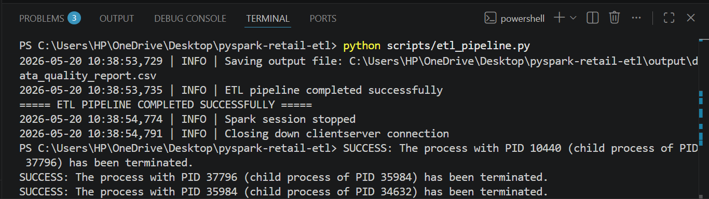
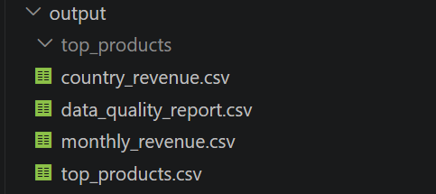

# End-to-End PySpark Retail ETL Pipeline

## Project Overview

This project is an end-to-end Data Engineering ETL pipeline built with PySpark. It extracts raw retail transaction data, performs data cleaning and business transformations, creates analytical datasets, and loads the final outputs as CSV files.

The project demonstrates practical Data Engineering skills such as ETL pipeline development, data validation, logging, transformation logic, aggregation, and structured project organization.

## Tech Stack

- Python
- PySpark
- Pandas
- CSV
- Logging

## Project Structure

pyspark-retail-etl/

- config/
- data/
  - data.csv
- logs/
  - etl_pipeline.log
- output/
  - top_products.csv
  - country_revenue.csv
  - monthly_revenue.csv
  - data_quality_report.csv
- scripts/
  - etl_pipeline.py
- README.md
- requirements.txt

## Dataset

The project uses retail transaction data containing invoice details, product descriptions, quantity, unit price, customer ID, country, and invoice date.

Input file:

- data/data.csv

## ETL Process

## 1. Extract

The pipeline reads raw retail transaction data from a CSV file using PySpark.

## 2. Transform

The transformation layer performs the following operations:

- Calculates Revenue using Quantity multiplied by UnitPrice
- Removes null records
- Removes duplicate records
- Filters cancelled or negative quantity orders
- Filters invalid zero or negative unit prices
- Converts invoice date into timestamp format
- Creates an InvoiceMonth column for monthly trend analysis
- Aggregates total revenue by product
- Aggregates total revenue by country
- Aggregates monthly revenue trends

## 3. Data Quality Checks

The pipeline includes basic data quality validation:

- Checks total raw records
- Checks total cleaned records
- Calculates removed records after cleaning
- Saves a data quality report as CSV

## 4. Load

The processed analytical datasets are saved in the output folder as CSV files.

Output files:

- output/top_products.csv
- output/country_revenue.csv
- output/monthly_revenue.csv
- output/data_quality_report.csv

## Business Questions Answered

1. Which products generated the highest revenue?
2. Which countries generated the highest revenue?
3. How does revenue trend month by month?
4. How many records were removed during data cleaning?

## Key Outputs

| Output File | Description |
|---|---|
| top_products.csv | Products ranked by total revenue |
| country_revenue.csv | Countries ranked by total revenue |
| monthly_revenue.csv | Revenue aggregated by month |
| data_quality_report.csv | Raw, cleaned, and removed record counts |

## How To Run

Install dependencies:

- pip install -r requirements.txt

Run the ETL pipeline:

- python scripts/etl_pipeline.py

## Screenshots

### Pipeline Execution

### Output Files

## Final Result

The pipeline converts raw retail transaction data into clean, business-ready analytics outputs using PySpark.